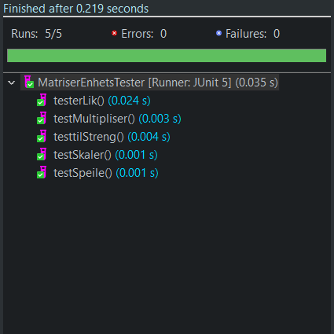

# DAT100 - Obligatoriske Innlevering 2

- JPLab 5: Oppgave O1-A [(github.com/dat100hib/.../jplab5/JP5.md#obligatoriske-oppgave-o1-a)](https://github.com/dat100hib/dat100public/blob/master/programmering/jplab5/JP5.md#obligatoriske-oppgave-o1-a)
  - [asdf]()
- JPLab 6: Oppgave O1-B [(github.com/dat100hib/.../jplab6/JP6.md#obligatoriske-oppgave-o1-b)](https://github.com/dat100hib/dat100public/blob/master/programmering/jplab6/JP6.md#obligatoriske-oppgave-o1-b)

 

