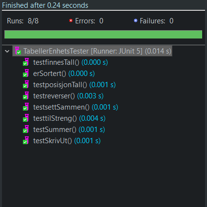
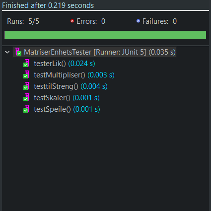

# DAT100 - Obligatoriske Innlevering 2

Denne oppbevaringsplasssen inneholder startkode og enhetstester for den obligatoriske innlevering av de to oppgave fra Java programmeringslab 5 og 6:

- JPLab 5: Oppgave O1-A (https://github.com/dat100hib/dat100public/blob/master/programmering/jplab5/JP5.md#obligatoriske-oppgave-o1-a)
- JPLab 6: Oppgave O1-B (https://github.com/dat100hib/dat100public/blob/master/programmering/jplab6/JP6.md#obligatoriske-oppgave-o1-b)

 
